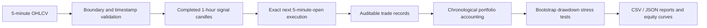
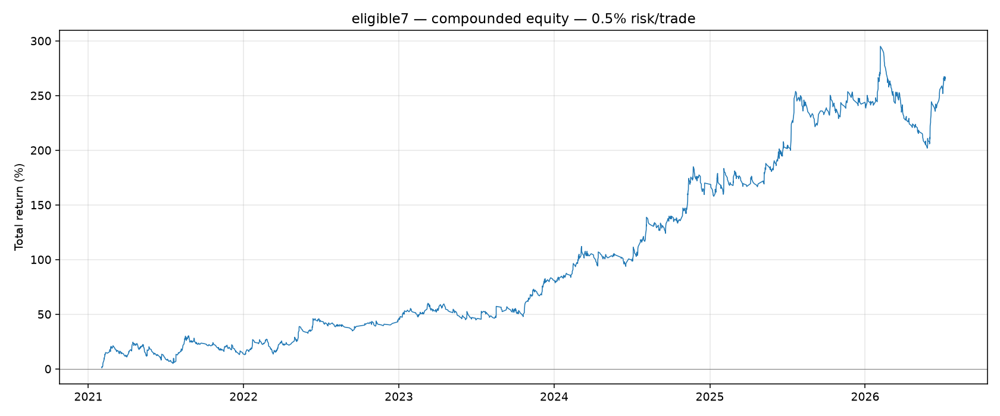

# Multi-Asset Crypto Strategy Research

> Public project brief — methodology and results only. The implementation and
> raw market data are maintained in a private repository.

An auditable, cost-aware research project for a multi-asset Donchian breakout
strategy. The work focuses on correct multi-timeframe execution, explicit
trading costs, chronological validation, portfolio accounting and drawdown
stress testing. It is a historical simulation, **not a live trading system or
investment advice**.

## Project scope

- Evaluated the frozen strategy across 15 crypto assets.
- Built a rule-selected seven-asset research basket: BTC, SOL, XRP, ETH, ADA,
  DOGE and AVAX.
- Covered 65.3 observed months from 1 February 2021 through 12 July 2026.
- Tested fixed-fraction portfolio risk levels from 0.5% to 3.0% per trade.
- Ran seeded 10,000-path, three-month block-bootstrap drawdown simulations.

The seven-asset basket is not a market-cap index. Eligibility required positive
net R in the 2021–2024 development period and in 2025. Therefore, its 2025
basket result is not presented as pristine OOS evidence. The basket remained
positive in the later 2026 slice.

## Research architecture

## Frozen strategy protocol

| Component | Rule |
|---|---|
| Entry signal | Close Donchian DC36 on completed hourly candles |
| Stop | Prior high/low Donchian DC18, frozen at entry |
| Target | 2R from actual entry and initial risk |
| Execution | Exact next five-minute candle open |
| Fee | 5 bps per side |
| Adverse slippage | 1 bp per fill |
| Same-candle ambiguity | Stop assumed before target |

Missing execution candles skip the setup rather than filling late. Signal,
entry and exit timestamps remain distinct, and net P&L is derived from actual
simulated fills after explicit costs.

## Headline portfolio results

The primary public comparison uses the seven-asset basket. Portfolios are
uncapped fixed-fraction simulations based on realized closed-trade equity.

| Risk/trade | Total return | CAGR | Historical max DD | Bootstrap P95 DD | P(DD > 45%) |
|---:|---:|---:|---:|---:|---:|
| **0.5%** | **+265.35%** | **26.86%** | **23.58%** | **25.65%** | **0.04%** |
| 1.0% | +989.96% | 55.05% | 42.05% | 46.36% | 6.12% |
| 2.0% | +5,536.80% | 109.64% | 67.56% | 74.88% | 64.30% |
| 3.0% | +14,985.16% | 151.17% | 82.64% | 90.45% | 94.08% |

The predefined historical drawdown comparison gate was 45%. The 2% and 3%
scenarios fail that gate and are retained as negative risk evidence rather than
recommended configurations. The 0.5% scenario is the conservative headline
case.

## Calendar-year consistency

Annual aggregate net R for the seven-asset basket:

| Observed slice | 2021* | 2022 | 2023 | 2024 | 2025 | 2026* |
|---|---:|---:|---:|---:|---:|---:|
| Net R | +30.56 | +52.83 | +46.98 | +82.60 | +52.32 | +15.56 |

\* 2021 begins on 1 February; 2026 ends on 12 July. Positive basket-level
performance does not mean every asset or every month was profitable.

## Local parameter sensitivity

DC36 remains the frozen entry window. A post-checkpoint local sensitivity test
held SL18 and 2R fixed:

| Entry window | Development R/mo | 2025 R/mo | 2026 R/mo | Full R/mo | Full PF |
|---|---:|---:|---:|---:|---:|
| DC35 | +4.386 | +4.613 | +1.995 | +4.196 | 1.235 |
| **DC36** | **+4.533** | **+4.363** | **+2.454** | **+4.300** | **1.243** |
| DC37 | +4.359 | +4.036 | +3.075 | +4.175 | 1.234 |

The similarity around DC36 is evidence against a single knife-edge optimum. It
does not prove that selection overfitting is impossible.

## Validation controls

- Signals use completed hourly candles and full warm-up history.
- Entry occurs only at the exact next five-minute open.
- Stops are frozen at entry; R is calculated from actual fills and initial risk.
- Gross P&L, fees and net P&L remain separately auditable.
- Portfolio drawdown is peak-relative rather than additive R drawdown.
- The active private implementation has 31 automated regression tests.
- Report generation is deterministic for a fixed simulation seed.

## Limitations

- This is historical research, not a live account record.
- Binance spot OHLCV is used as a price proxy for a strategy that can go short.
- Funding, liquidation, margin rules, order-book depth and partial fills are not
  modeled.
- Portfolio drawdown uses realized closed-trade equity rather than full
  mark-to-market equity.
- Current-universe survivorship bias remains possible.
- The seven-asset eligibility rule uses development and 2025 results.
- A sealed future paper-trading period is still required for stronger forward
  evidence.

## Public artifacts

- [`results/annual_eligible7.csv`](results/annual_eligible7.csv)
- [`results/risk_summary.csv`](results/risk_summary.csv)
- [`results/local_sensitivity.csv`](results/local_sensitivity.csv)

Source code, exchange credentials and raw market data are not included in this
public project brief. The private implementation can be demonstrated during a
technical interview.
