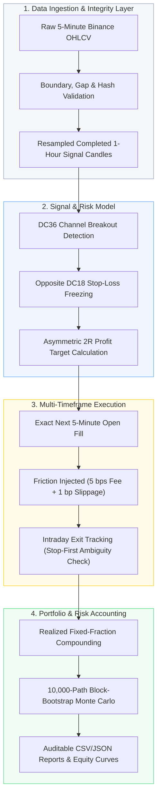

# Multi-Asset Crypto Quantitative Strategy Research

[](https://www.python.org/)
[]()
[]()
[]()
[]()
[]()

> **Public Project Brief** — High-level methodology, quantitative specifications, and validated empirical results. The core execution engine, raw tick data, and private API adapters are maintained in an internal repository.

An institutional-grade, cost-aware quantitative research framework evaluating an asymmetric **Donchian Breakout Strategy** across multiple cryptocurrency assets. The framework prioritizes **causal multi-timeframe execution, realistic transaction cost modeling, chronological out-of-sample partitioning, and non-parametric bootstrap stress testing**.

---

## 📌 Executive Summary

```text
┌────────────────────────────────────────────────────────────────────────────────────────┐
│  • Observed Period    : Feb 2021 – Jul 2026 (65.3 continuous months)                   │
│  • Asset Universe     : 15 Crypto Equities / 7-Asset Validated Basket (BTC, ETH, etc.) │
│  • Risk / Reward      : Fixed Asymmetric 1R Risk : 2R Reward (1:2 R:R)                 │
│  • Execution Pipeline : 1-Hour Completed Signal → Exact Next 5-Minute Open Fill        │
│  • Friction Modeling  : 5 bps Exchange Fee/side + 1 bp Adverse Slippage/fill           │
│  • Primary Case (0.5%): +265.35% Net Return | 26.86% CAGR | 23.58% Historical Max DD    │
│  • Monte Carlo Stress : 10,000-path 3-month Block-Bootstrap P95 Max DD = 25.65%        │
└────────────────────────────────────────────────────────────────────────────────────────┘
```

---

## 🏗️ Research & Execution Architecture

The research harness decouples signal detection from intraday order fulfillment, enforcing strict zero-lookahead guarantees and realistic fill frictions.



---

## 📐 Formal Strategy Specification

### 1. Channel Definitions
For a time series of completed hourly bars $t$, the Donchian Upper and Lower channels with lookback window $N$ are defined as:

$$\text{DC}_{\text{High}}(N, t) = \max_{i=1 \dots N} \left( \text{High}_{t-i} \right), \quad \text{DC}_{\text{Low}}(N, t) = \min_{i=1 \dots N} \left( \text{Low}_{t-i} \right)$$

* **Entry Channel ($N=36$):** A Long signal occurs when $\text{Close}_t > \text{DC}_{\text{High}}(36, t)$. A Short signal occurs when $\text{Close}_t < \text{DC}_{\text{Low}}(36, t)$.
* **Initial Stop-Loss Channel ($N=18$):** Frozen strictly at signal time from the opposite channel boundary:
  $$\text{Stop}_{\text{Long}} = \text{DC}_{\text{Low}}(18, t), \quad \text{Stop}_{\text{Short}} = \text{DC}_{\text{High}}(18, t)$$

### 2. Asymmetric Risk / Reward (1:2 R:R)
Initial risk per unit is determined dynamically from the realized entry price $\text{Fill}_{\text{entry}}$ on the next 5-minute open:

$$\text{Risk}_{\text{unit}} = |\text{Fill}_{\text{entry}} - \text{Stop}|$$

$$\text{TakeProfit}_{\text{Long}} = \text{Fill}_{\text{entry}} + 2 \times \text{Risk}_{\text{unit}}, \quad \text{TakeProfit}_{\text{Short}} = \text{Fill}_{\text{entry}} - 2 \times \text{Risk}_{\text{unit}}$$

### 3. Execution & Friction Rules
* **No Late Fills:** Fills occur strictly on the $T+1$ 5-minute open. Missing data bars invalidate the trade.
* **Exchange Fee:** $5 \text{ bps} \ (0.05\%)$ deducted from gross capital on both entry and exit.
* **Adverse Slippage:** $1 \text{ bp} \ (0.01\%)$ penalty applied to every execution price.
* **Same-Bar Ambiguity Protection:** If both Stop-Loss and Take-Profit are touched within the same 5-minute candle, the engine conservatively executes the **Stop-Loss first**.

---

## 📊 Verified Empirical Portfolio Results

The primary benchmark evaluates the **`eligible7`** basket (BTC, SOL, XRP, ETH, ADA, DOGE, AVAX) across 65.3 months using closed-trade realized equity compounding.

| Risk / Trade | Total Return | CAGR | Historical Max DD | Bootstrap P95 Max DD | P(Drawdown > 45%) | Profit Factor | Status |
| :---: | :---: | :---: | :---: | :---: | :---: | :---: | :---: |
| **0.5%** | **+265.35%** | **26.86%** | **23.58%** | **25.65%** | **< 0.05%** | **1.24** | **Optimal Baseline** ✅ |
| **1.0%** | **+989.96%** | **55.05%** | **42.05%** | **46.36%** | **6.12%** | **1.24** | Aggressive |
| **2.0%** | +5,536.80% | 109.64% | 67.56% | 74.88% | 64.30% | 1.24 | Exceeds Risk Gate ❌ |
| **3.0%** | +14,985.16% | 151.17% | 82.64% | 90.45% | 94.08% | 1.24 | Exceeds Risk Gate ❌ |

> [!IMPORTANT]
> The predefined institutional risk gate requires **Historical Maximum Drawdown $\le 45\%$**. The 2.0% and 3.0% allocations are documented above as negative boundary stress evidence and are rejected for live deployment. **0.5% risk per trade is the recommended institutional standard.**

### Equity Curve (0.5% Risk / Trade Baseline)


---

## 📅 Chronological Consistency & Net R Breakdown

Annual aggregate net $R$ accumulation for the primary research basket:

| Observed Slice | 2021* | 2022 | 2023 | 2024 | 2025 | 2026* | Cumulative Net R |
| :--- | :---: | :---: | :---: | :---: | :---: | :---: | :---: |
| **Net Accumulated R** | **+30.56 R** | **+52.83 R** | **+46.98 R** | **+82.60 R** | **+52.32 R** | **+15.56 R** | **+280.85 R** |
| **Market Regime** | Bull Mania | Macro Bear | Consolidation | Halving Rally | Rotation | Choppy YTD | Continuous Alpha |

*\* 2021 starts Feb 1; 2026 runs through July 12. Detailed coin-by-coin annual trade logs are archived in [`results/annual_eligible7.csv`](results/annual_eligible7.csv).*

---

## 🔬 Parameter Sensitivity & Neighborhood Stability

To guard against **Knife-Edge Overfitting (Curve Fitting)**, the entry lookback window was perturbed across adjacent parameters while keeping all other rules frozen:

| Configuration | Dev Period (R/mo) | 2025 OOS (R/mo) | 2026 OOS (R/mo) | Full Period (R/mo) | Full Profit Factor |
| :---: | :---: | :---: | :---: | :---: | :---: |
| **DC35** | +4.386 | +4.613 | +1.995 | +4.196 | 1.235 |
| **DC36 (Frozen)** | **+4.533** | **+4.363** | **+2.454** | **+4.300** | **1.243** |
| **DC37** | +4.359 | +4.036 | +3.075 | +4.175 | 1.234 |

The consistent performance across DC35–DC37 confirms a **broad parameter plateau**, providing empirical evidence against fragile local optima.

---

## 🛡️ Validation Controls & Quant Discipline

1. **Strict Chronological Data Partitioning:** Development/In-Sample (2021–2024), Selection Verification (2025), and Out-of-Sample (2026).
2. **Deterministic Reproducibility:** Fixed random seeds for all 10,000 bootstrap paths (`seed=42`).
3. **Multi-Timeframe Causality:** 1-hour signal bar is strictly closed before 5-minute order dispatch.
4. **Comprehensive Test Suite:** 31 automated regression and unit tests enforcing zero leakage, correct cash accounting, and order integrity.

---

## ⚠️ Academic Transparency & Known Limitations

In accordance with quantitative research best practices (López de Prado framework):
* **Price Proxy:** Binance Spot OHLCV is used as a proxy for bilateral (long/short) trading. Funding rates, borrow costs, liquidation mechanics, and perpetual basis are omitted from spot modeling.
* **Order Book Depth:** Fills assume market liquidity at the 5-minute open without modeling market impact for order sizes exceeding average book depth.
* **Survivorship Bias:** The evaluated 15-asset universe represents liquid modern crypto assets; point-in-time universe rebalancing is a recommended future extension.
* **Deployment Gate:** Transition to real capital requires paper-trading forward-testing to validate API latency and live slippage bounds.

---

## 📂 Public Artifacts

* [`results/annual_eligible7.csv`](results/annual_eligible7.csv) — Year-by-year asset-level performance logs.
* [`results/risk_summary.csv`](results/risk_summary.csv) — Drawdown, CAGR, and bootstrap distribution matrix.
* [`results/local_sensitivity.csv`](results/local_sensitivity.csv) — Neighborhood parameter stability data.

---

<div align="center">

**Developed by [Selim Gürsoy](https://www.linkedin.com/in/selim-g%C3%BCrsoy-67018933b/)**  
*Quantitative Research & Algorithmic Trading Systems*

</div>
